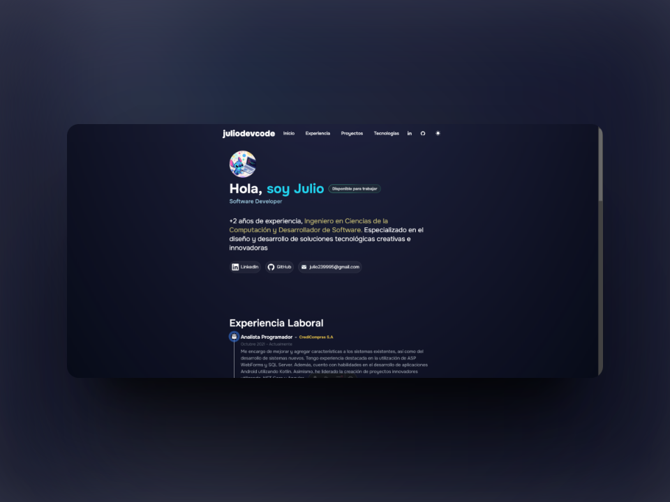

# Portafolio Web creado en Astro

¡Te doy la bienvenida a mi portafolio web!

He creado este portafolio utilizando **[Astro](https://astro.build/)**
, una herramienta moderna para la construcción de sitios web estáticos, con la guía y recursos proporcionados por **[midudev](https://www.youtube.com/@midulive)** . En este espacio, presento una selección de mis trabajos, proyectos y habilidades, con el objetivo de brindar una visión clara de mi perfil profesional y lo que puedo ofrecer.

## Características

- **Diseño Responsivo**: El portafolio está diseñado para adaptarse a diferentes dispositivos y tamaños de pantalla, proporcionando una experiencia de usuario óptima en cualquier dispositivo.
- **Secciones claramente definidas**: El portafolio se divide en secciones fácilmente navegables, que incluyen una presentación personal, proyectos destacados, habilidades técnicas, entre otros.
- **Fácil de mantener**: Gracias a Astro, mantener y actualizar mi portafolio es sencillo y eficiente.

## Tecnologías Utilizadas

- **Astro**: Utilizado como el generador de sitio estático principal.
- **HTML, CSS, JavaScript**: Utilizados para la estructura, estilo e interactividad del sitio.
- **Tailwind CSS**: Framework de CSS utilizado para un desarrollo rápido y consistente.
- **Git**: Utilizado para el control de versiones y colaboración en el desarrollo del proyecto.

